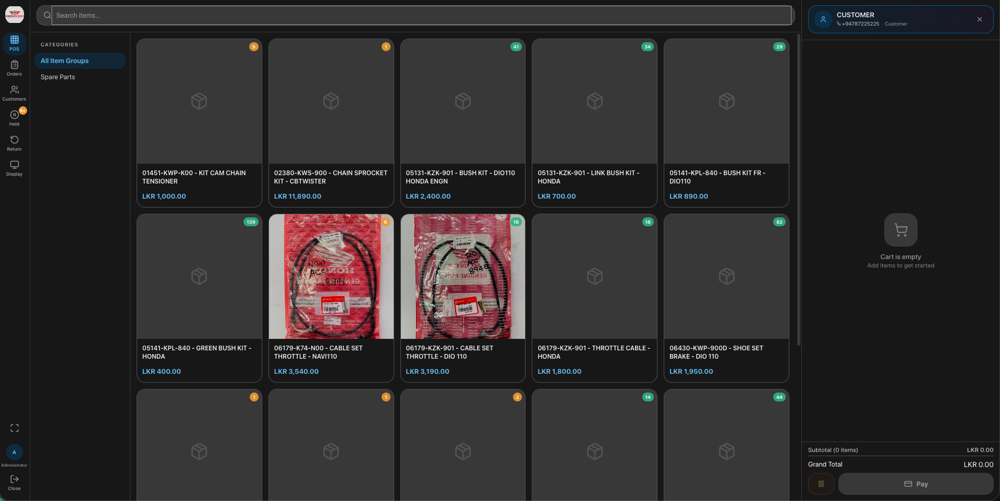
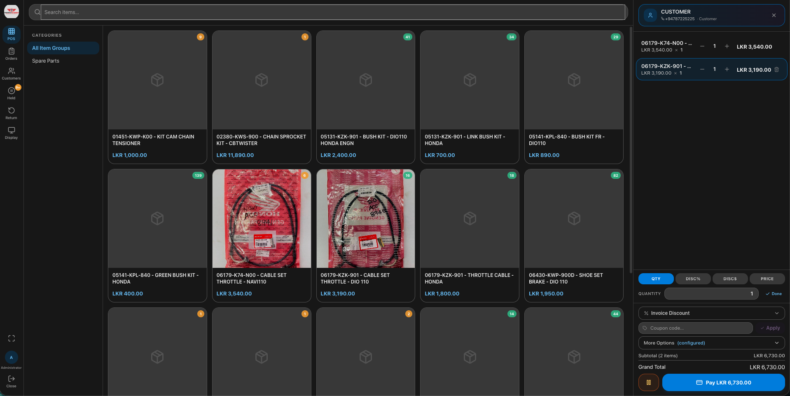
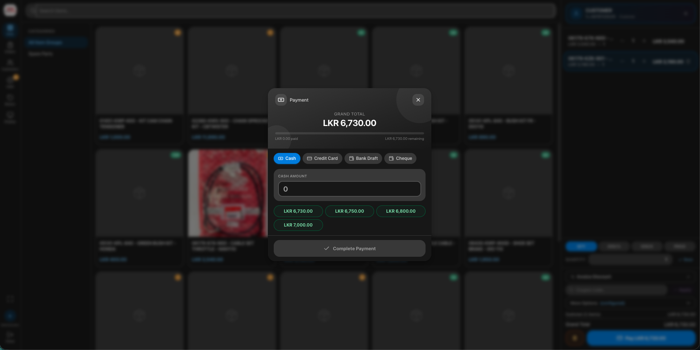
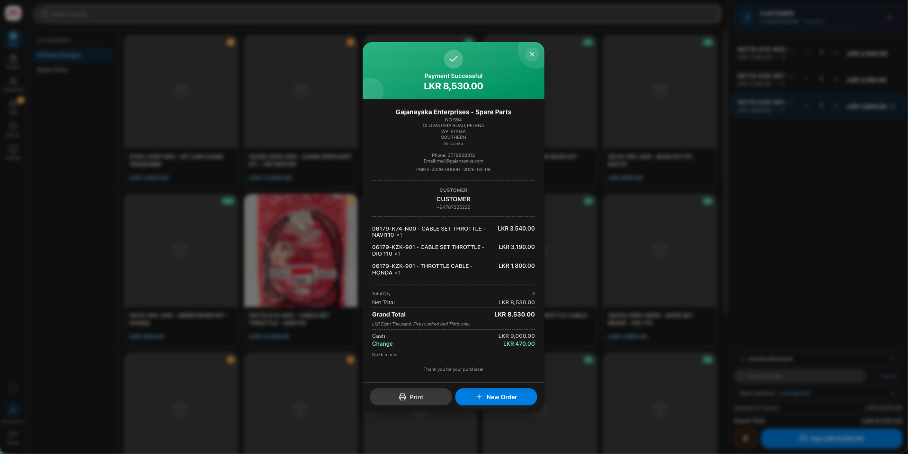
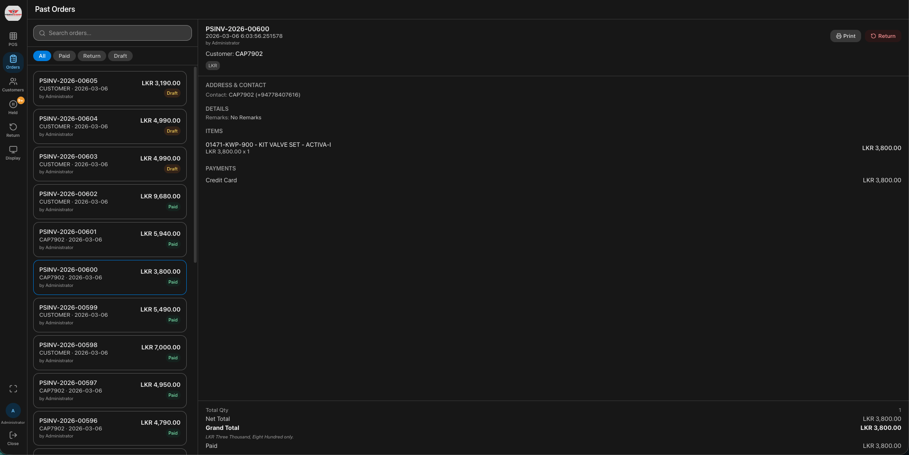
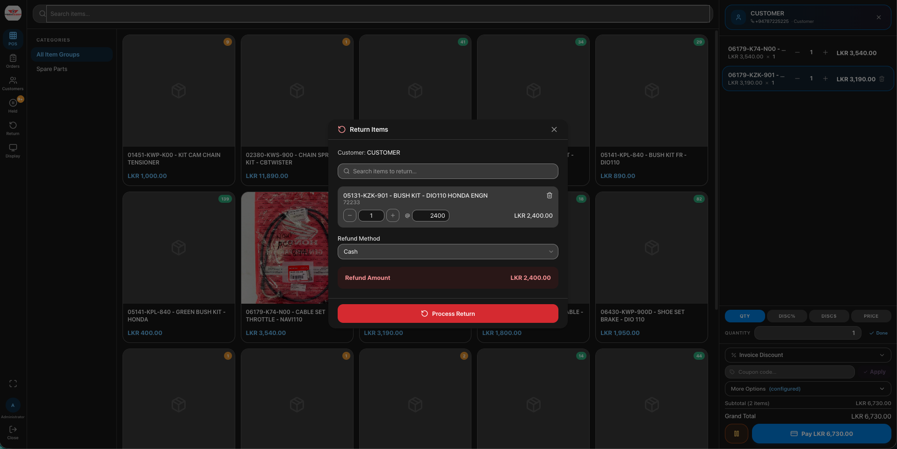
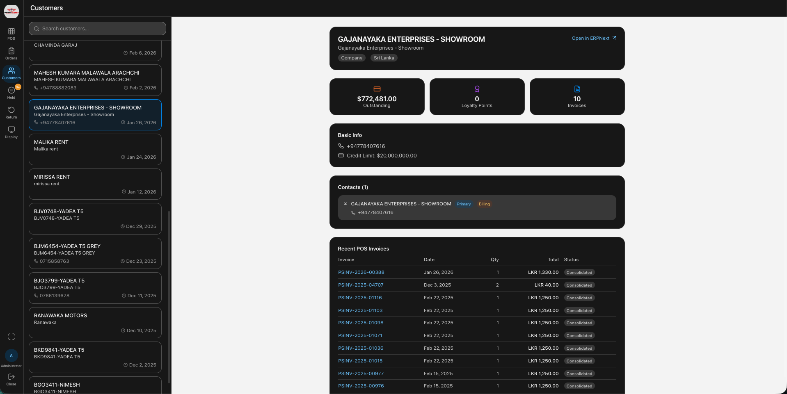
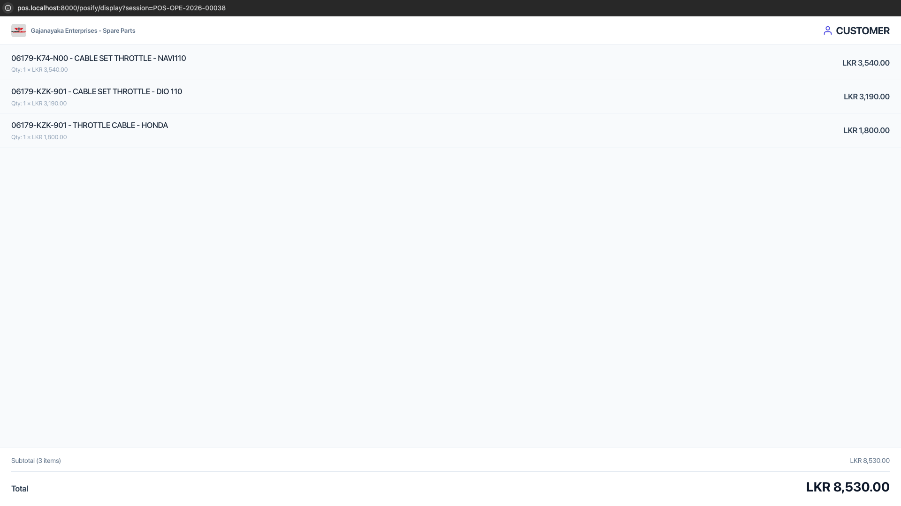
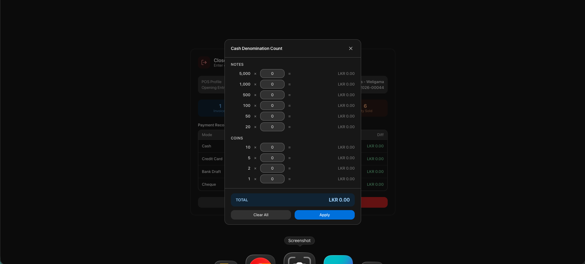
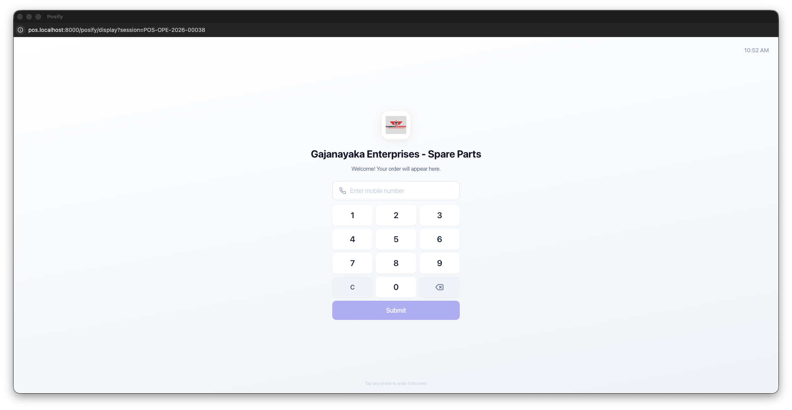

<div align="center">

# POS Prime

**A modern, fast Point of Sale for ERPNext**

Built for speed, touch screens, and real retail workflows.

[](https://www.gnu.org/licenses/gpl-3.0)
[](https://frappeframework.com)
[](https://github.com/sponsors/ravindu2012) [](https://buymeacoffee.com/ravindu2012)

</div>

---

## Why POS Prime?

ERPNext's built-in POS is functional but limited. POS Prime is a complete replacement built from the ground up with Vue 3, designed for businesses that need a fast, reliable, and modern point of sale.

- **Fuzzy item search** with barcode scanning — typos, partial matches, and out-of-order words all work
- **Real-time stock validation** so you never sell what you don't have
- **Loyalty points** — redeem points at checkout with live balance deduction
- **Store credit** — automatically detects customer credit from returns/overpayments, apply at checkout with double-spend prevention
- **Partial payments & credit limits** — split pay, pay later, with automatic credit limit enforcement
- **Pricing rule discounts** — promo badges, strikethrough prices, and discount labels on items
- **Resizable cart panel** — drag to resize the cart column, persisted across sessions
- **Self-checkout kiosk mode** for customer-facing touchscreens
- **Customer pole display** support (screen-based and VFD serial) with discount indicators
- **Keyboard shortcuts** (F1-F10) for lightning-fast checkout
- **i18n ready** — all UI strings wrapped for translation, RTL layout support
- **Works with ERPNext's inventory, taxes, and accounting** - no separate system

---

## Zero Modifications to ERPNext

POS Prime does **not** add custom fields, custom doctypes, or modify any existing ERPNext schema. It works entirely with ERPNext's standard doctypes:

- **POS Profile** - your existing POS configuration
- **POS Opening Entry** - standard shift management
- **POS Invoice** - native ERPNext invoices, fully compatible with consolidation and accounting
- **Item, Customer, Item Price, Bin** - reads directly from your existing data
- **Item Tax Template, Sales Taxes and Charges** - uses your existing tax setup

**Why this matters:**
- Upgrade ERPNext freely - POS Prime will never block or break your upgrades
- Uninstall cleanly - remove POS Prime and nothing changes in your ERPNext data
- No data lock-in - every invoice POS Prime creates is a standard POS Invoice, visible in Desk and reports
- Works alongside ERPNext's built-in POS - use both if you want

---

## Screenshots

### POS - Item Grid & Cart
Browse items by category, search by name or barcode, and build the cart with a single tap.



### POS - Cart with Items
Full cart sidebar with quantity controls, discounts, coupon codes, and real-time totals.



### POS - Payment
Multiple payment methods - Cash, Credit Card, Bank Draft, Cheque. Split payments supported.



### POS - Payment Success
Invoice receipt with print option after successful payment.



### POS - Past Orders
View, search, and manage all past invoices. Filter by status - All, Paid, Return, Draft.



### POS - Returns
Process returns directly from the POS with item search, quantity adjustment, and refund method selection.



### POS - Customer 360
Complete customer profile with contact info, loyalty points, and recent invoice history.



### Customer Pole Display
Dedicated customer-facing display showing live cart items and totals. Supports both screen-based and VFD serial displays.



### Denomination Calculator
Cash counting made easy - count notes and coins by denomination and auto-populate the amount field. Available on both Open Shift and Close Shift screens.



### Customer Display - Welcome Screen
Customer display with phone number entry for loyalty point lookup.



---

## Features

### Point of Sale
- Fuzzy item search powered by Fuse.js — typos, partial matches, and out-of-order words all work
- Virtual scrolling item grid for smooth performance with large catalogs (powered by @tanstack/vue-virtual)
- Item grid with images, categories, and stock indicators
- Barcode scanner support (USB/Bluetooth HID scanners)
- Keyboard shortcuts (F1-F10) for lightning-fast checkout — works even inside input fields
- Cart with inline quantity, discount, and price controls
- Multiple payment methods (Cash, Card, Bank Draft, Cheque)
- Split payments across multiple methods
- Partial payments with confirmation dialog (requires POS Profile `Allow Partial Payment`)
- Credit limit enforcement — displays outstanding, credit limit, and available credit; blocks transactions that would exceed the limit
- Loyalty points redemption — apply points at checkout with live grand total update
- Coupon code support
- Invoice-level and item-level discounts
- Tax calculation with Item Tax Templates
- POS returns and refunds
- Order history with search and filters
- Print and reprint invoices
- Email receipts with PDF attachment
- Hold and resume orders (with delete confirmation)
- Auto-fetch serial numbers (FIFO)
- Product Bundle support with computed stock availability
- Cash denomination calculator for opening/closing shifts (21 currencies supported)
- Resizable cart panel — drag the handle between items and cart to adjust width, persisted in localStorage
- Collapsible item categories sidebar — toggle visibility, preference saved across sessions
- Correct rounding support — uses ERPNext's `rounded_total` for payment calculations, change, and display
- Dark/Light mode follows ERPNext user theme preference
- Favicon and app logo from Website Settings

### Pricing Rules & Discounts
- Real-time pricing rule preview — promo badge, strikethrough original price, discount percentage/amount badges
- Supports all ERPNext pricing rule types: Discount %, Discount Amount, Fixed Rate
- Transaction-level promo discounts shown in cart summary
- Customer Pole Display mirrors discount indicators (Promo badge, strikethrough, discount badge)

### Store Credit
- Automatically detects available store credit from customer returns and overpayments
- GL-based credit calculation with unconsolidated POS Invoice tracking for double-spend prevention
- Apply partial or full store credit at checkout with editable amount input
- Server-side re-validation at submit time — caps to actual available credit
- Works across multiple POS terminals and shifts for the same company
- V14: works without any POS Profile setting; V15/V16: requires `Allow Partial Payment` enabled
- Credit consumption tracked via `outstanding_amount` on unconsolidated POS Invoices

### Loyalty Points
- Automatic loyalty point balance display on customer selector and payment dialog
- Redeem points at checkout — checkbox auto-applies full balance, or enter custom amount
- Live grand total update showing original price, redemption deduction, and effective total
- Points × conversion factor calculation shown inline
- Reads from ERPNext's standard Loyalty Program and Loyalty Point Entry doctypes

### Partial Payments & Credit Limits
- Allow zero-payment or partial-payment invoices when `Allow Partial Payment` is enabled on POS Profile
- Confirmation dialog before processing partial payments showing paid vs outstanding
- Customer outstanding balance aggregated from both Sales Invoices and POS Invoices
- Remaining credit limit displayed in payment header
- Credit limit exceeded warning blocks submission when new outstanding would breach the limit
- Invoices created with correct outstanding amount and Unpaid status

### Internationalization (i18n) & RTL
- All UI strings wrapped with `__()` translation function for Frappe's translation system
- RTL-compatible layout using CSS logical properties (`border-e`, `end-0`, etc.)
- RTL auto-detection from Frappe boot language data
- Accessible dialogs with `role="dialog"`, `aria-modal`, `aria-label`, and Escape key handling

### Self-Checkout Kiosk
- Fullscreen kiosk mode for dedicated touchscreens
- Barcode scanning + manual item code entry
- Phone number lookup for customer loyalty
- Card and cash payment flows
- Auto-reset after transaction completes
- Idle timeout returns to welcome screen
- Navigation prevention (no accidental exits)

### Customer Display
- Real-time cart mirroring on a second screen
- Company branding with logo
- Phone number entry for loyalty points
- VFD serial display support
- Multi-session broadcast

### Customer 360
- Customer profile with contact details
- Loyalty points balance with badge on customer selector
- Outstanding balance and credit limit badges on customer selector
- Recent POS invoice history
- Quick customer search with phone number normalization

### Batch & Serial Number Management
- Batch selection with qty and expiry dates
- Manual serial number entry or scan
- Auto-fetch serial numbers by quantity (FIFO order)
- Batch-filtered serial number selection

### Product Bundles
- Automatic detection of Product Bundle items
- Computed availability based on component stock
- Visual "Bundle" badge on item cards
- Component-level stock validation on invoice submission

### Email Receipts
- Email invoice PDF to customer from receipt screen or order detail
- Pre-fills customer email when available
- Custom message support
- Uses POS Profile print format for PDF attachment

### Theme & Branding
- Automatically follows ERPNext user's Dark/Light/Automatic theme preference
- App logo from Website Settings (falls back to Company logo)
- Favicon from Website Settings
- App name from Website Settings shown in browser tab

### Keyboard Shortcuts

| Shortcut | Action |
|----------|--------|
| F1 or / | Focus item search |
| F2 | Toggle held orders |
| F3 or F9 | Open payment |
| F4 or Ctrl+S | Hold current order |
| F5 or Ctrl+O | Open past orders |
| F8 or Ctrl+N | New order |
| F10 | Toggle returns |
| Ctrl+Enter | Open payment |
| Escape | Close current dialog |

All F-key shortcuts work globally, even when typing in input fields.

---

## POS Profile Field Coverage

POS Prime reads **38 of 40 meaningful fields** from the standard POS Profile doctype (95% coverage). The following fields are intentionally not used:

| Field | Reason |
|-------|--------|
| `disabled` | Filtered at query level when listing available profiles; not needed at runtime |
| `country` | Read-only field auto-fetched from Company by Frappe; not directly consumed |

All 12 layout fields (Section Break, Column Break) are structural and only relevant to the Desk form UI.

---

## Compatibility

| ERPNext Version | Frappe Version | Status |
|----------------|---------------|--------|
| v14 | v14 | Supported |
| v15 | v15 | Supported |
| v16 | v16 | Supported |

### Version-Specific Notes

| Feature | v14 | v15 | v16 |
|---------|-----|-----|-----|
| Store credit | Works without settings | Requires `Allow Partial Payment` | Requires `Allow Partial Payment` |
| Partial payments | Supported (no field needed) | Requires `Allow Partial Payment` | Requires `Allow Partial Payment` |
| Serial/Batch bundles | Legacy fields | `serial_and_batch_bundle` | `serial_and_batch_bundle` |
| Campaign field | `campaign` | `campaign` | `utm_campaign` |
| POS Closing invoices | `pos_transactions` | `pos_transactions` | `pos_invoices` |

---

## Installation

```bash
cd $PATH_TO_YOUR_BENCH
bench get-app https://github.com/ravindu2012/pos-prime --branch main
bench --site your-site.localhost install-app pos_prime
```

After installation, navigate to `/pos-prime` on your site to open the POS.

### Kiosk Mode

1. Open a POS session in POS Prime
2. Navigate to `/pos-prime/kiosk` on your touchscreen device
3. The kiosk auto-detects the open session

### Customer Display

1. Open a POS session in POS Prime
2. Click the **Customer Display** panel in the sidebar
3. Open the display URL on your second screen

---

## Tech Stack

- **Frontend**: Vue 3 + TypeScript + Pinia + Tailwind CSS
- **UI Framework**: frappe-ui
- **Backend**: Frappe Framework + ERPNext
- **Build**: Vite
- **Search**: Fuse.js (fuzzy matching)
- **Virtualization**: @tanstack/vue-virtual
- **i18n**: Frappe translation system (`__()`) with RTL support

---

## Contributing

This app uses `pre-commit` for code formatting and linting:

```bash
cd apps/pos-prime
pre-commit install
```

Tools used: ruff, eslint, prettier, pyupgrade

---

## License

GPL v3 - see [license.txt](license.txt)

---

<div align="center">

**A [Raveforge](https://github.com/ravindu2012) Product**

[](https://github.com/sponsors/ravindu2012) [](https://buymeacoffee.com/ravindu2012)

</div>
